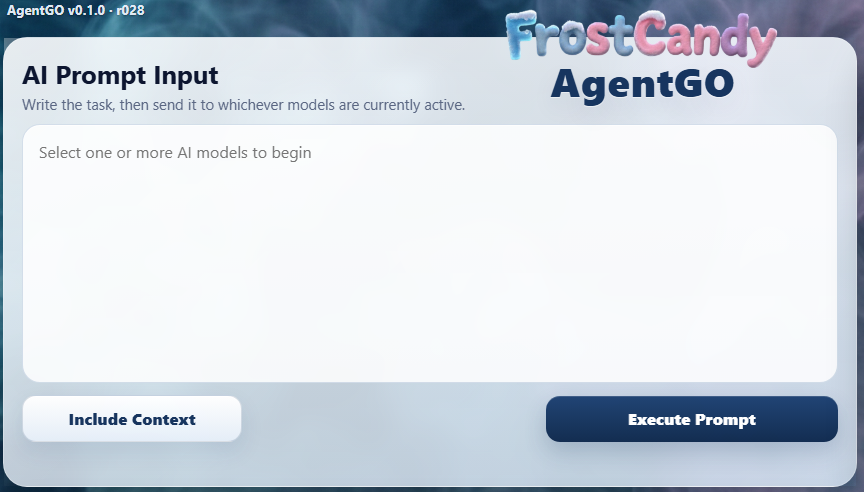
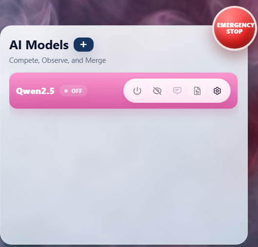
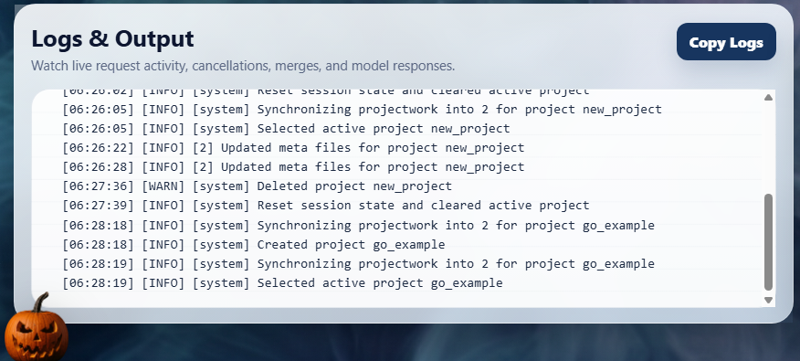
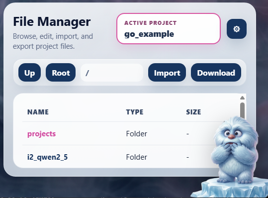
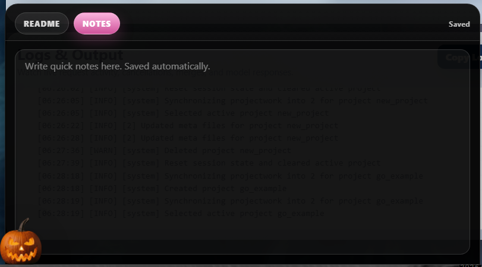
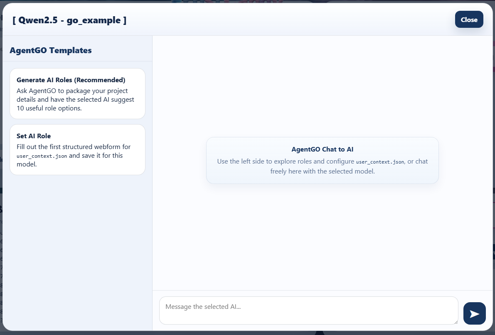
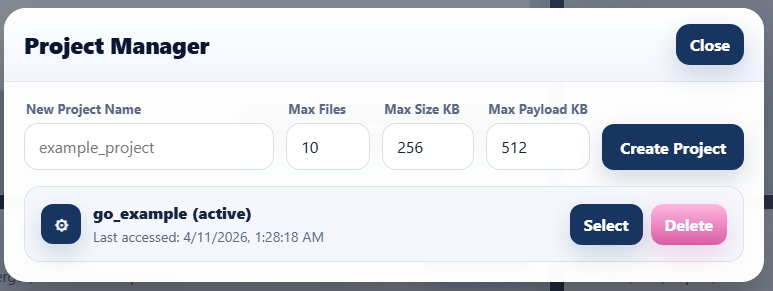
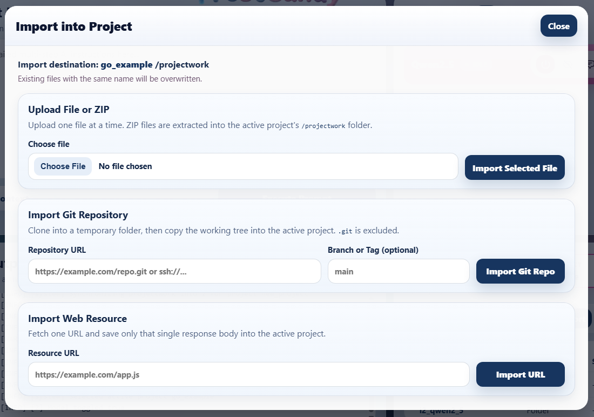
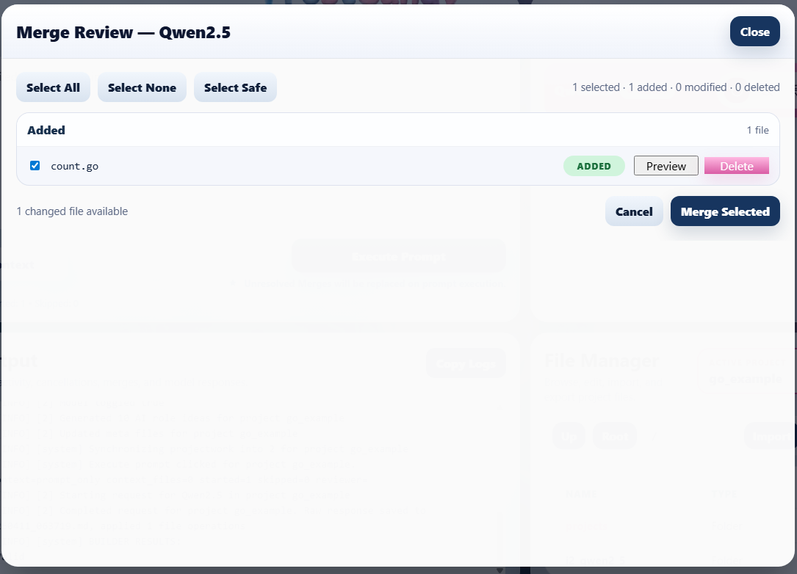
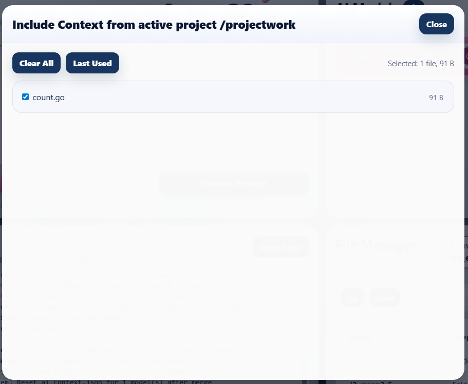

# FrostCandy AgentGO

AgentGO is a local multi-model AI workspace for **competitive prompting, human review, and selective merge**.

Instead of sending one prompt to one model and accepting whatever comes back, AgentGO lets you:

- send the same task to multiple AI builders
- keep each model's work in its own separate workspace
- review logs, outputs, imports, and file changes in one place
- merge only the changes you actually want into the active project's source of truth

That makes AgentGO useful for coding, drafting, experimentation, refactoring, and guided iteration where you want **control**, not blind overwrite.

---

## What the product does

At a high level, AgentGO combines five jobs into one interface:

1. **Prompt router** — send one task to whichever builder models are active.
2. **Project workspace manager** — keep a canonical project folder for the active project.
3. **Context picker** — choose exactly which project files the builders should see.
4. **Review surface** — inspect logs, generated changes, and merge candidates before accepting them.
5. **Merge tool** — move only approved changes into the active project's `projectwork` folder.

The result is a workflow where AI can move fast, but the human stays in charge.

---

## Core workflow

1. **Create or select a project** in Project Manager.
2. **Choose the AI models** you want active.
3. **Import or create files** inside the active project's workspace.
4. **Optionally include context files** from `projectwork`.
5. **Write a prompt** and click **Execute Prompt**.
6. **Let each builder model generate output** in its own model-specific workspace.
7. **Inspect logs and review merge-ready changes**.
8. **Merge only the files you want** into the active project's source of truth.

---

## Key concepts

### `projectwork` is the source of truth
For every active project, the canonical workspace lives in:

`/work/projects/<project-name>/projectwork`

That is the folder AgentGO treats as the main project state.

### Builder workspaces are separate
Each builder model works in its own model-specific project folder. A model can generate changes without directly overwriting the active project's `projectwork`.

### Merge is intentional
Nothing becomes the new truth until you review and merge it.

### Context is selective
You do not have to send the entire codebase every time. The **Include Context** flow lets you pick only the files that matter for the next run.

### Meta files guide behavior
Per-model context files such as **User**, **AI Builder**, and **AI Reviewer** help shape how a model should behave for the active project.

---

## Product walkthrough

### 1) AI Prompt Input

<table>
<tr>
<td width="54%" valign="top">

</td>
<td valign="top">

The **AI Prompt Input** panel is where each run starts.

Use this area to describe the task you want the active builder models to perform. The main controls here are:

- **Prompt box** — where you describe the job
- **Include Context** — choose project files to send along with the prompt
- **Execute Prompt** — send the request to all active models

This panel is designed for one-to-many prompting: one task, multiple builders, separate outputs.

</td>
</tr>
</table>

### 2) AI Models

<table>
<tr>
<td valign="top">

The **AI Models** panel controls which builders participate.

Here you can:

- turn models on or off
- open model settings
- mark review-related state
- access model-specific actions such as merge and configuration
- add more models to the workspace

Think of this section as the roster for the current run. Only active models receive the next prompt.

</td>
<td width="54%" valign="top">

</td>
</tr>
</table>

### 3) Logs & Output

<table>
<tr>
<td width="54%" valign="top">

</td>
<td valign="top">

The **Logs & Output** panel gives you live visibility into what AgentGO is doing.

Use it to watch:

- request activity
- project selection and synchronization
- file and merge operations
- warnings and errors
- model execution flow

This area is especially useful when you are testing a new project setup or validating that imports, merges, and context steps happened in the order you expected.

</td>
</tr>
</table>

### 4) File Manager

<table>
<tr>
<td valign="top">

The **File Manager** is the main workspace browser.

From here you can:

- browse the `/work` tree
- see the current path
- move to **Up** or **Root**
- import files into the active project
- download the active project's `projectwork`
- identify the active project at a glance

At root level, **projects** is emphasized because that is where the canonical project workspaces live.

</td>
<td width="54%" valign="top">

</td>
</tr>
</table>

### 5) README / NOTES drawer

<table>
<tr>
<td width="54%" valign="top">

</td>
<td valign="top">

The **knowledge drawer** provides two quick-reference spaces:

- **README** — product-facing reference material
- **NOTES** — quick, auto-saved working notes

Only one view is shown at a time. Use NOTES for local reminders, ideas, and scratchpad thinking while you work through a session.

</td>
</tr>
</table>

### 6) AgentGO Templates / role setup

<table>
<tr>
<td valign="top">

The **AgentGO Templates** area helps you prepare structured context for a model.

From this modal you can:

- ask AgentGO to generate AI role ideas
- choose a role and move it into the form
- set or refine the user's intended AI behavior for the current model
- chat with the selected model while staying inside the project setup flow

This is where AgentGO starts becoming more than a prompt launcher. It becomes a guided role-and-context editor for project-specific model behavior.

</td>
<td width="54%" valign="top">

</td>
</tr>
</table>

### 7) Project Manager

<table>
<tr>
<td width="54%" valign="top">

</td>
<td valign="top">

The **Project Manager** is where you create, select, and remove projects.

When you create a project you can define limits such as:

- max files
- max size in KB
- max payload in KB

Once selected, the project becomes the active target for imports, execution context, and merge destination.

</td>
</tr>
</table>

### 8) Import into Project

<table>
<tr>
<td valign="top">

The **Import into Project** modal supports multiple ways to bring material into the active project's `projectwork`.

Current import options include:

- **Upload File or ZIP**
- **Import Git Repository**
- **Import Web Resource**

This makes it easy to seed a project from existing local files, a repo snapshot, or a single fetched web resource before handing the work to the builder models.

</td>
<td width="54%" valign="top">

</td>
</tr>
</table>

### 9) Merge Review

<table>
<tr>
<td width="54%" valign="top">

</td>
<td valign="top">

The **Merge Review** modal is where AgentGO becomes a controlled human-in-the-loop system.

Use this screen to:

- inspect changed files
- select or deselect candidates
- preview individual changes
- discard bad changes
- merge only the approved set

This is the core safety feature of the product. Builders can move quickly, but the user decides what becomes part of the project.

</td>
</tr>
</table>

### 10) Include Context

<table>
<tr>
<td valign="top">

The **Include Context** modal lets you choose exactly which files from the active project's `projectwork` should be sent along with the next prompt.

That helps you:

- reduce unnecessary token usage
- focus the builders on the right files
- avoid sending the whole project when only one or two files matter

This is one of the most important controls in AgentGO because it keeps the workflow efficient and targeted.

</td>
<td width="54%" valign="top">

</td>
</tr>
</table>

---

## FAQ

### What is AgentGO in one sentence?
AgentGO is a local multi-model AI workspace where several builders can work on the same task, while you keep control over context, review, and merge.

### What is `projectwork`?
`projectwork` is the canonical workspace for the active project. It is the main source of truth that imports, context selection, and merges revolve around.

### Do builders write directly into `projectwork`?
No. Builder models work in their own model-specific workspaces. Their output only becomes canonical after you approve and merge it.

### Why is Merge Review important?
Merge Review is what keeps the workflow safe. You can inspect candidate files before they become part of the active project.

### What does Include Context do?
It lets you choose which files from the active project's `projectwork` are sent with the next prompt, so you can keep prompts focused and reduce waste.

### Why do I see `projects` and model folders at root?
The File Manager can browse broadly inside `/work`. The `projects` folder contains canonical project workspaces, while model folders represent model-specific working areas.

### What is the difference between User, AI Builder, and AI Reviewer meta files?
These files shape how a model behaves in the active project:

- **User** — user-facing intent, role, or instructions
- **AI Builder** — builder-oriented working context
- **AI Reviewer** — reviewer-oriented evaluation context

### What happens when I merge?
Approved files are copied into the active project's `projectwork`, which becomes the new source of truth for the next round.

### Can I import an existing codebase?
Yes. You can upload a file or ZIP, import from a Git repository, or fetch a single web resource into the active project.

### Is AgentGO only for code?
No. The same workflow also works for structured writing, documentation, prompts, role design, and other file-based projects where multiple AI candidates are useful.

---

## Why this workflow matters

A lot of AI tools are optimized for quick answers. AgentGO is optimized for **iterative project work**.

It is built for situations where you want:

- multiple candidate solutions
- isolated model workspaces
- explicit context control
- visible logs and operations
- human approval before merge

That combination makes AgentGO feel closer to a real working environment than a single chat box.
